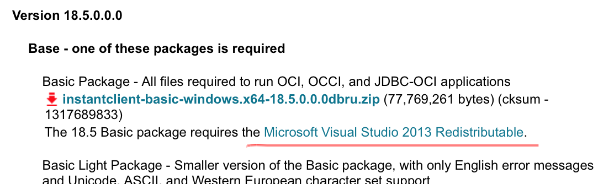
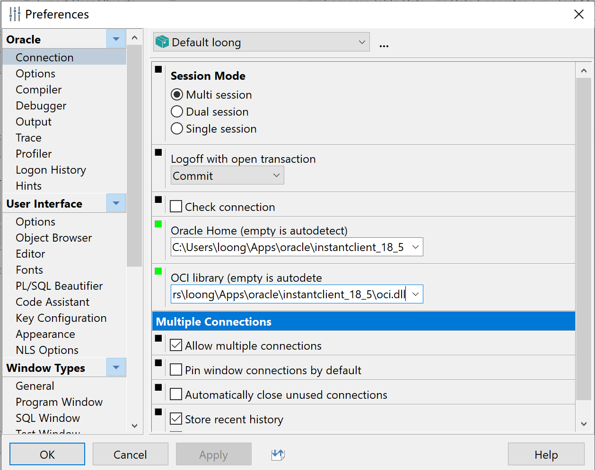

# PL/SQL Developer 

## 安装

最新版本为13，下载64位，[官网](https://www.allroundautomations.com)

> 中文需要下载中文语言包，貌似下载地址消失了，估计还没搞好。

```
注册码
product code：4vkjwhfeh3ufnqnmpr9brvcuyujrx3n3le
serial Number：226959
password：xs374ca
```

## 使用

需要oracle/oracle client，推荐安装oracle client，省的安装庞大的oracle了。[官网](https://www.oracle.com/technetwork/database/database-technologies/instant-client/downloads/index.html)

> 现在官网下载oracle的东西需要注册登陆。

下载最新的64位，**18.5.0.0.0**版本，向下兼容。需要下载Basic Package，SQL*Plus Package，Tools Package这3个压缩包。同时注意下载Basic Packag包时，有说明这个依赖 [Microsoft Visual Studio 2013 Redistributable](https://support.microsoft.com/en-us/kb/2977003#bookmark-vs2013)，下载2013的，我下载了2017不行。也可以下载Basic Light Package，更推荐Basic Package。



1. 解压Basic Package包，得到instantclient_18_5，可以把它放到比如C:\Users\loong\Apps\oracle\instantclient_18_5
2. 分别解压SQL*Plus Package，Tools Package这2个包，把解压的instantclient_18_5里面的文件复制到C:\Users\loong\Apps\oracle\instantclient_18_5目录里去。
3. 在上面目录下新建文件夹network，再进入network里新建文件夹admin，在admin目录里新建文件tnsnames.ora，内容如下：第1行的orcl表示这个数据库的别名，可以随便写，登陆时用；第3行中的ip根据实际oracle的ip填写；第6行的orcl为oracle的服务名；有多个数据库时，可以再加一个下面的配置，别名不同即可。

```
ORCL =
  (DESCRIPTION =
    (ADDRESS = (PROTOCOL = TCP)(HOST = 192.168.18.17)(PORT = 1521))
    (CONNECT_DATA =
      (SERVER = DEDICATED)
      (SERVICE_NAME = ORCL)
    )
  )
```

> 这步也可以省掉，这个主要是配置database的别名，方便使用PL/SQL Developer登陆时，填写database只要填写上面的ORCL就可以了，不配这个，database就要填写全称：192.168.18.17/orcl；这个配置应该也适用于导入导出命令。

4. 打开PL/SQL Developer，直接关闭登陆窗口，打开Preferences->Oracle->Connection，配置Oracle Home填C:\Users\loong\Apps\oracle\instantclient_18_5，OCI library填C:\Users\loong\Apps\oracle\instantclient_18_5\oci.dll，如下图：



> 注意：一定要记得安装Microsoft Visual C++ 2013 Redistributable (x64)。