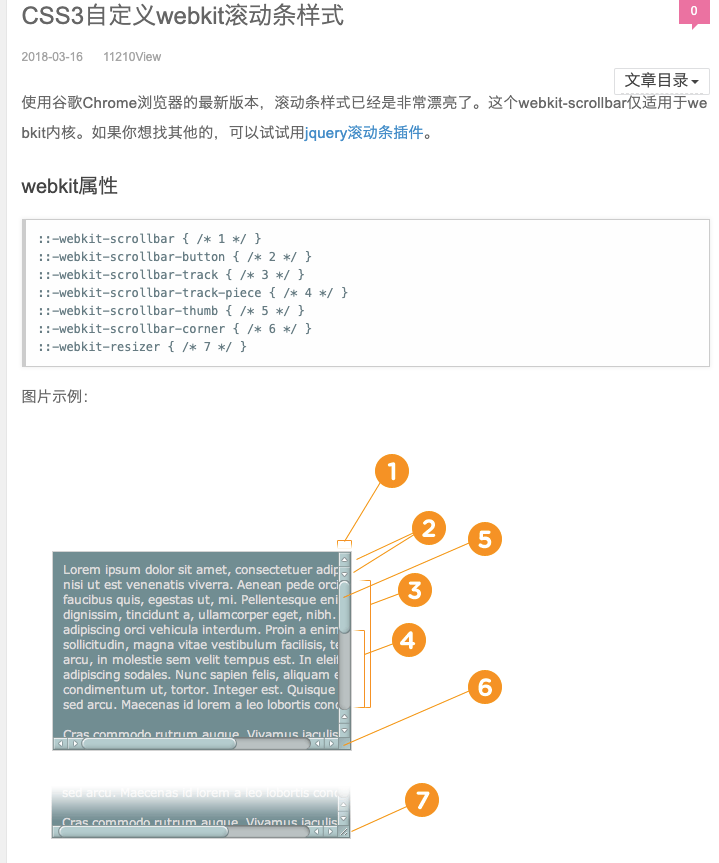
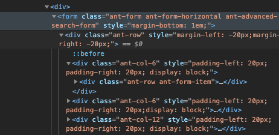
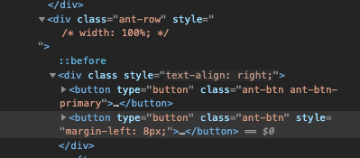

```css
:horizontal
//horizontal伪类适用于任何水平方向上的滚动条
:vertical
//vertical伪类适用于任何垂直方向的滚动条
:decrement
//decrement伪类适用于按钮和轨道碎片。表示递减的按钮或轨道碎片，例如可以使区域向上或者向右移动的区域和按钮
:increment
//increment伪类适用于按钮和轨道碎片。表示递增的按钮或轨道碎片，例如可以使区域向下或者向左移动的区域和按钮
:start
//start伪类适用于按钮和轨道碎片。表示对象（按钮 轨道碎片）是否放在滑块的前面
:end
//end伪类适用于按钮和轨道碎片。表示对象（按钮 轨道碎片）是否放在滑块的后面
:double-button
//double-button伪类适用于按钮和轨道碎片。判断轨道结束的位置是否是一对按钮。也就是轨道碎片紧挨着一对在一起的按钮。
:single-button
//single-button伪类适用于按钮和轨道碎片。判断轨道结束的位置是否是一个按钮。也就是轨道碎片紧挨着一个单独的按钮。
:no-button
no-button伪类表示轨道结束的位置没有按钮。
:corner-present
//corner-present伪类表示滚动条的角落是否存在。
:window-inactive
//适用于所有滚动条，表示包含滚动条的区域，焦点不在该窗口的时候。
::-webkit-scrollbar-track-piece:start {
/*滚动条上半边或左半边*/
}
::-webkit-scrollbar-thumb:window-inactive {
/*当焦点不在当前区域滑块的状态*/
}
::-webkit-scrollbar-button:horizontal:decrement:hover {
/*当鼠标在水平滚动条下面的按钮上的状态*/
}
```

form 居中，现在外层的div设置-20px



按钮左右 


