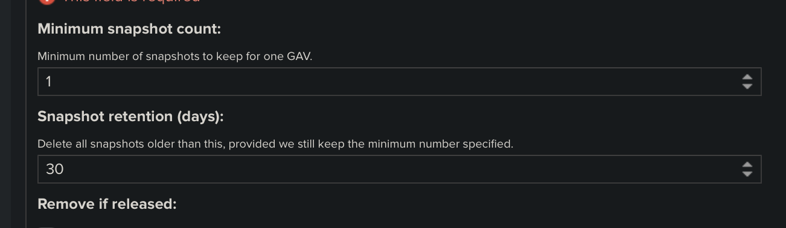

# Nexus 学习

## docker部署

docker仓库地址：<https://hub.docker.com/r/sonatype/nexus3/>

```sh
# 1: 下载镜像
docker pull sonatype/nexus3:3.14.0
# 2. 创建容器卷（推荐这个模式）
docker volume create --name nexus-data
# 3. 运行个容器
docker run -d -p 8081:8081 -p 8082:8082 -p 8083:8083 --name nexus -v nexus-data:/nexus-data sonatype/nexus3
# 2. 创建工作文件夹
mkdir /data/nexus-data && chown -R 200 /data/nexus-data
# 3. 运行个容器
docker run -d -p 8081:8081 --name nexus -v /data/nexus-data:/nexus-data sonatype/nexus3
```

> 初始账号密码：admin:admin123
> 
> 推荐使用`3.14.0`，3.15有问题，无法给代理仓库配置用户密码，有些仓库需要用户密码才能下载（也可能在其他地方配置，没找到怎么配置的）
> 
> 上面运行3个端口映射：8081是默认访问端口，8082配置为docker-hosted的提交端口，8083配置为docker-group的下载端口（这个只能下载不能上传），后面使用时，最好每个端口映射一个域名。

## 仓库信息备份

```
maven-clojars
https://repo.clojars.org/
maven-aliyun
https://maven.aliyun.com/repository/public/
maven-central(自带)
https://repo.maven.apache.org/maven2/ 或者 https://repo1.maven.org/maven2/
maven-wiseloong-releases username:wiseloong password:wiseloong@2019
http://mvn.wiseloong.com/repository/maven-releases/
maven-wiseloong-snapshot
http://mvn.wiseloong.com/repository/maven-snapshots/
maven-wiseloong-thirdparty
http://mvn.wiseloong.com/repository/thirdparty/

docker-hosted 开启http：8082，用于上传
docker-group 开启http：8083，用于下载
docker-aliyun
https://s36hsj1h.mirror.aliyuncs.com/

maven-publish
```

```sh

docker volume create nexus-data
docker run -d -p 8110:8081 -p 8090:8082 -p 80:8083 --name nexus3 -v nexus-data:/nexus-data --restart=always sonatype/nexus3:3.14.0
```

> 配置中央仓库，或公共仓库比如阿里，把2个验证配置关掉；1.调整`Layout policy`为`Permissive`，2.关闭`Strict Content Type Validation`

## Nginx反向代理开启https

```
server {
    listen 80;
    server_name dc.wisdragon.com;
    rewrite ^(.*)$ https://${server_name}$1 permanent; 
}
server {
    listen 443 ssl;
    server_name dc.wisdragon.com;
    ssl_certificate /nginx/cert/wisdragon.com.bundle.crt;
    ssl_certificate_key /nginx/cert/cert.key.pem;
    location / {
        proxy_set_header X-Forwarded-Proto $scheme;
        proxy_set_header Host $host;
        proxy_set_header X-Forwarded-Port $server_port;
        proxy_set_header X-Real-IP $remote_addr;
        proxy_set_header X-Forwarded-For $proxy_add_x_forwarded_for;
        proxy_pass http://192.168.19.25:8081;
    }
}
```

> 如果不添加这个`proxy_set_header X-Forwarded-Proto "https";`会一直卡在 Initialize...

## 开启ssl后idea信任证书

开启ssl后，idea无法使用仓库，下载jar包是报错，需要信任证书（不知是不是自签证书造成的，有机会验证下），不是在系统安装的jdk里信任证书，而是在idea自带的jre里信任证书，（如果使用自己安装的maven，则在系统jdk里信任），只需要信任nginx的证书就可以了，也可以直接信任根证书。

```sh
/Applications/IntelliJ\ IDEA.app/Contents/jdk/Contents/Home/jre/bin/keytool -import -alias wisdragon -keystore /Applications/IntelliJ\ IDEA.app/Contents/jdk/Contents/Home/jre/lib/security/cacerts -file /Users/loong/app/cert/wisdragon.com.bundle.crt -storepass changeit
```

> 上面为mac命令，使用idea.app里jre的keytool命令添加证书，不是直接keytool命令添加，windows同理使用应用里的jre。
> 
> -alias 为给个别名，-keystore 密钥库路径，-file 为证书位置，-storepass 密钥库密码，changeit为默认密码。

## 开启ssl后Java信任证书

```sh
keytool -import -alias wisdragon -keystore /Library/Java/JavaVirtualMachines/jdk1.8.0_181.jdk/Contents/Home/jre/lib/security/cacerts -file /Users/loong/app/cert/root.crt -storepass changeit
```

## 使用中遇到的问题

### idea 仓库更新index出错


解决方法：需要创建定时更新index文件任务（admin登陆nexus）


## 开启docker私有仓库

新建一个docker *hosted* ，填写个名字docker

### 开通push


> 需要配置个端口，通过这个端口实现上传下载

### 公开pull


## 代理snapshots仓库时，不能及时获取最新包

需要手动清理缓存；或者设置下面的保留缓存时间为1分钟。


## 定期删除snapshots包

tasks 里新建一个Maven-Delete SNAPSHOT，默认最小保留1个，保留30天内的，可以把30天修改为1。


