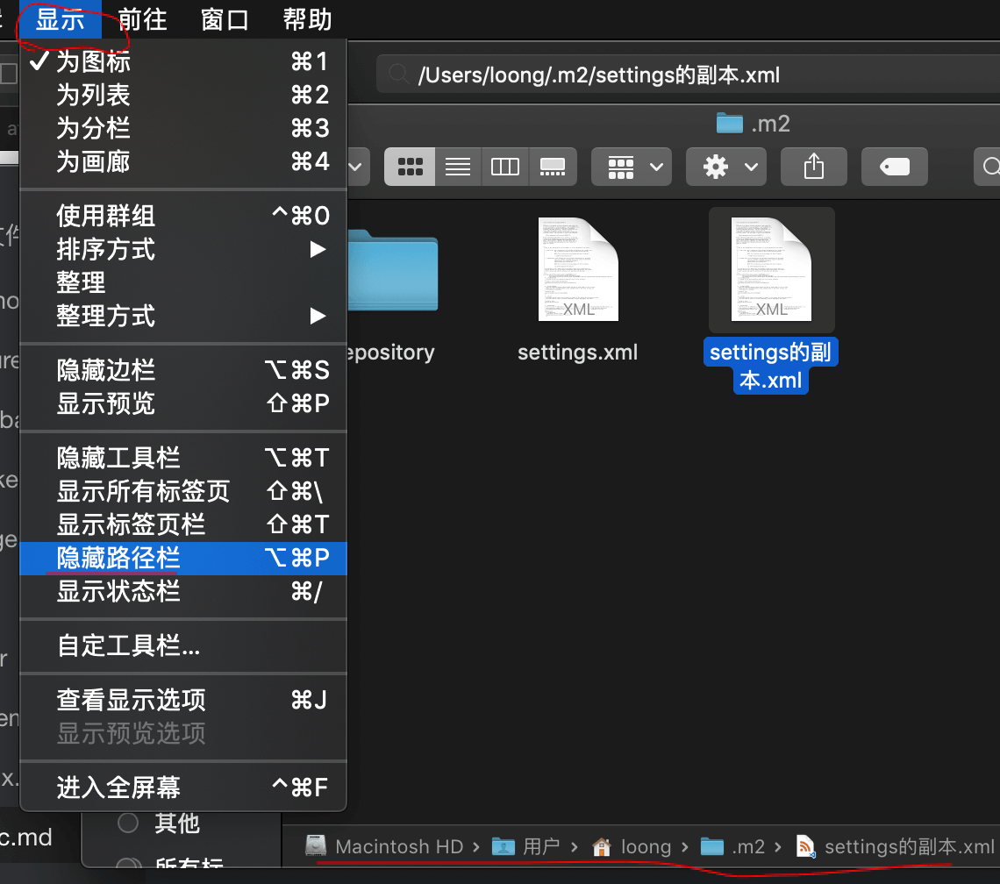
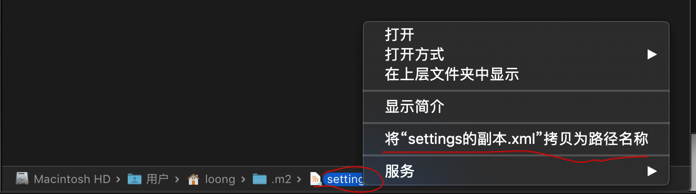
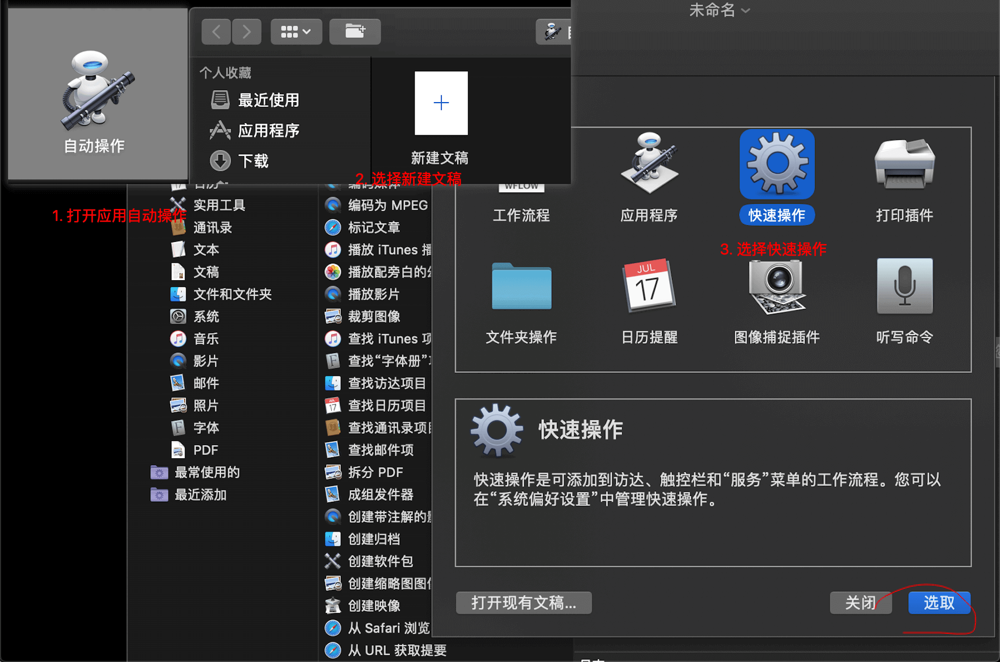
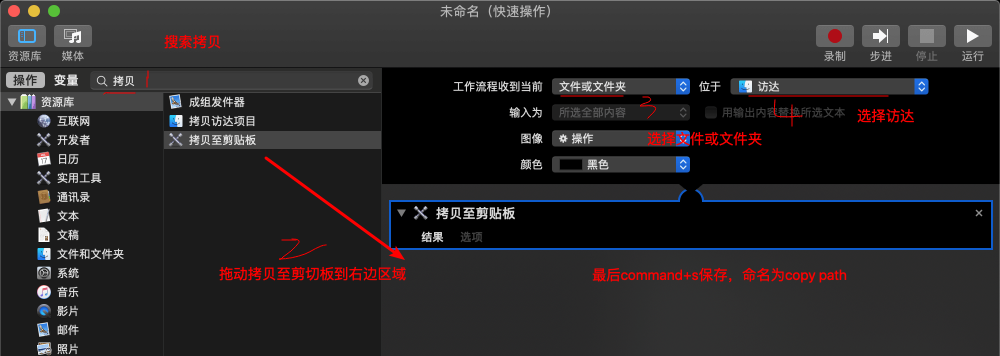
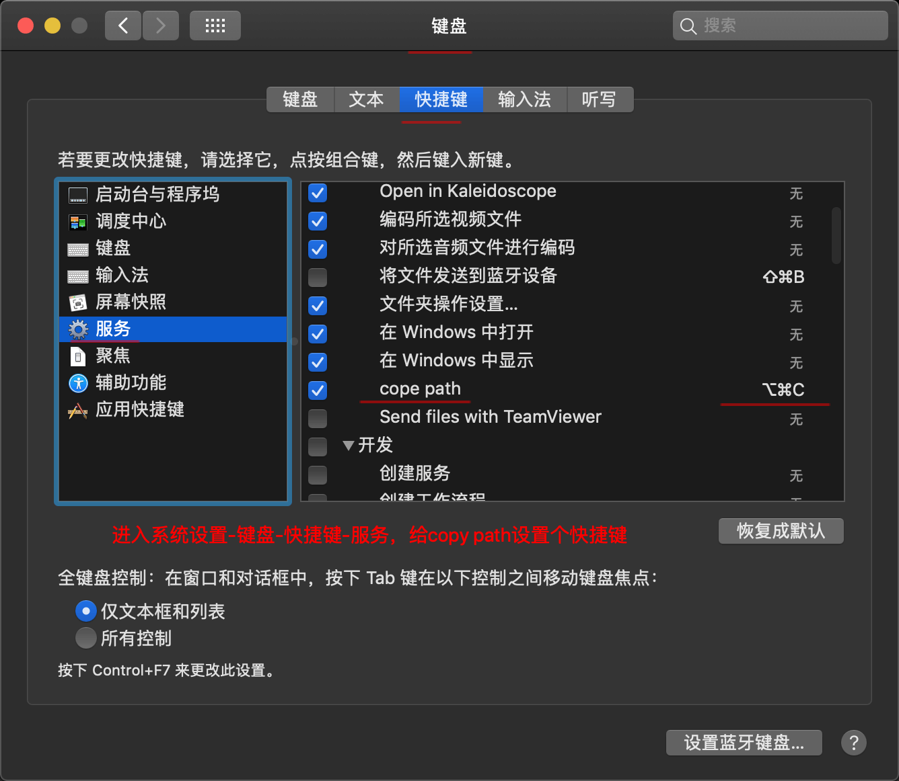
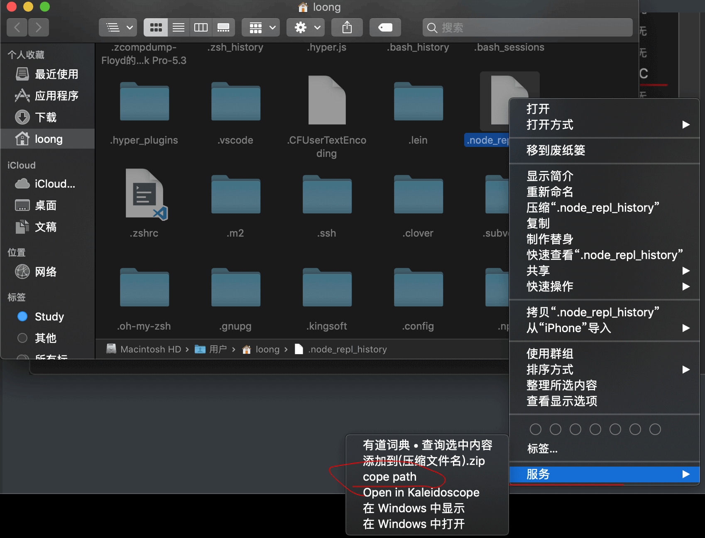

# zsh

## [zsh-autosuggestions](https://github.com/zsh-users/zsh-autosuggestions)（命令自动补全）

``` sh
# Oh My Zsh-安装方式
git clone https://github.com/zsh-users/zsh-autosuggestions ${ZSH_CUSTOM:-~/.oh-my-zsh/custom}/plugins/zsh-autosuggestions
# 修改 ~/.zshrc，添加插件
plugins=(git zsh-autosuggestions)
```

## [powerline-status](https://powerline.readthedocs.io/en/latest/installation/osx.html) （不用安装）

```sh
# 先安装python，安装的是python3（mac系统安装的是python2，Xcode command line tool）
brew install python
# 使用pip3安装（Python3自带pip3，mac系统的python2没有pip，只有easy_install，可以使用锁sudo easy_install pip安装pip）
pip3 install --user powerline-status
# 查看
pip3 show powerline-status
# 根据上面查看的powerline-status所在目录，在~/.zshrc添加配置，{repository_root}改为所在目录
. {repository_root}/powerline/bindings/zsh/powerline.zsh
```

> 我觉得没必要安装这个，安装下面的字体就可以了。其他的主题都是需要字体，感觉和这个没关系吧。
>
> 上面配置powerline.zsh后还有错误，找不到powerline-config，算了不安装这个了，就当了解下pip3和pip吧。

## [Powerline Fonts](https://github.com/powerline/fonts) (字体)

``` sh
# clone
git clone https://github.com/powerline/fonts.git --depth=1
# install
cd fonts
./install.sh
# clean-up a bit
cd ..
rm -rf fonts
```

> 最后在 Hyper 终端的配置文件 `.hyper.js` 中修改字体，将 `fontFamily = '...'` 一项引号内添加"Meslo LG M for Powerline"或者其他 Powerline 字体，重启终端便可生效。

## [Spaceship Prompt](https://github.com/denysdovhan/spaceship-prompt)（主题）

``` sh
# Oh My Zsh 安装方式
git clone https://github.com/denysdovhan/spaceship-prompt.git "$ZSH_CUSTOM/themes/spaceship-prompt"
# 添加链接
ln -s "$ZSH_CUSTOM/themes/spaceship-prompt/spaceship.zsh-theme" "$ZSH_CUSTOM/themes/spaceship.zsh-theme"
# 修改 ~/.zshrc，修改主题
ZSH_THEME="spaceship"
```

## [Fira Code](https://github.com/tonsky/FiraCode)（为写程序而生的字体）

> 下载字体文件，解压，打开ttf文件夹，全选所有文件，右键选择使用字体册打开，然后点击安装


# svn使用

## 设置全局忽略文件夹或文件

用户目录下打开.subversion/config，添加global-ignores。

```
global-ignores = target *.iml .DS_Store .idea .svn log *.log .nrepl-port
```


# 快捷复制文件目录

1. 显示里开启路径栏，右键路径栏上路径，选择拷贝路径。(推荐，省事)





2. 使用自动操作，创建拷贝路径服务，再设置个快捷键









# idea

## 初始化设置

1. Appearance & Behavior -> System Settings 关闭Reopen last project on startup  (每次启动是否打开上一个项目)
2. Editor -> General -> Auto Import 打开 Add unambiguous imports on the fly  和 Optimmize imports on the fly(...)(打开自动添加依赖)
3. Editor -> General -> Code Completion 关闭 Match case: ... (关闭后，在输代码时忽略大小写来提示)
4. Editor -> General -> Editor Tabs 下拉 Placement:  选择None （关闭tabs，使用command+E 打开最近使用的文件）
5. Editor -> Code Style 下拉 Line separator: 选择 Unix and macOS (\n) (换行符使用unix的\n，实现与服务器统一)
6. Editor -> File Encodings 全部修改为 UTF-8 并勾选上 Transparent native-to-ascii conversion
7. Editor -> File Types  在 Ignore files and folders 里添加 .idea;*.iml; (项目里不显示文件)

## 常用插件

1. Cursive：clojure开发插件
2. Lombok Plugin
3. Rainbow Brackets：多彩括号
4. String Manipulation：字符串处理
5. IDE Features Trainer：idea使用介绍
6. LiveEdit：自动更新页面显示
7. NodeJS：

## 使用系统默认软件打开文件

比如我想使用系统安装的Typora打开.md文件，先在Editor -> File Types找到Markdown 删除*.md，再右键.md文件，选择Associate with File Type，再勾选Open matching files in associated application。